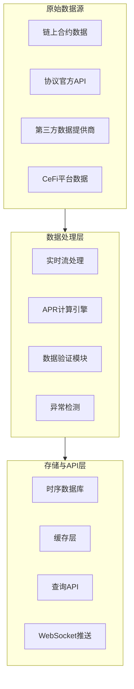

获取稳定币理财产品的实时APR数据是这类平台的核心技术挑战。我将为你提供一套**工业级解决方案**，覆盖所有主流协议和链，确保数据**准确、实时、可扩展**。

## 🔄 一、数据获取架构（三层数据源）



## 🔗 二、链上数据获取（最准确）

### 1. **借贷协议（Aave, Compound, Venus）**

```typescript
// Aave V3 数据获取示例
import { ethers } from 'ethers'

class AaveDataProvider {
  constructor(private provider: ethers.providers.JsonRpcProvider) {}

  async getAaveAPR(chainId: number, tokenAddress: string): Promise<number> {
    const poolAddress = this.getPoolAddress(chainId) // 获取对应链的池地址
    const poolAbi = ['function getReserveData(address) view returns (tuple(...))']
    
    const poolContract = new ethers.Contract(poolAddress, poolAbi, this.provider)
    const reserveData = await poolContract.getReserveData(tokenAddress)
    
    // 计算浮动利率
    const liquidityRate = reserveData.liquidityRate
    const apr = parseFloat(ethers.utils.formatUnits(liquidityRate, 25)) * 100
    
    return apr // 例如 4.67
  }
  
  private getPoolAddress(chainId: number): string {
    const addresses = {
      1: '0x87870Bca3F3fD6335C3F4ce8392D69350B4fA4E2', // Ethereum
      137: '0x794a61358D6845594F94dc1DB02A252b5b4814aD', // Polygon
      42161: '0x794a61358D6845594F94dc1DB02A252b5b4814aD' // Arbitrum
    }
    return addresses[chainId]
  }
}
```

### 2. **AMM协议（Curve, Balancer）**

```typescript
// Curve Finance 数据获取
class CurveDataProvider {
  async getCurveAPY(poolAddress: string, chainId: number): Promise<number> {
    // 1. 获取池子的总流动性
    const poolContract = new ethers.Contract(
      poolAddress, 
      ['function get_virtual_price() view returns (uint256)'], 
      provider
    )
    
    // 2. 获取历史费用数据
    const feeData = await this.getHistoricalFees(poolAddress, chainId)
    
    // 3. 计算APY = (费用 / 总流动性) * 365
    const dailyFees = feeData.last24hFees
    const totalLiquidity = await this.getTotalLiquidity(poolAddress)
    
    const dailyAPY = (dailyFees / totalLiquidity) * 100
    const annualAPY = dailyAPY * 365
    
    return annualAPY // 例如 8.2%
  }
  
  private async getHistoricalFees(poolAddress: string, chainId: number) {
    // 通过The Graph或链上事件获取历史费用
    const subgraphUrl = this.getSubgraphUrl(chainId)
    const query = `{
      pool(id: "${poolAddress.toLowerCase()}") {
        swapVolume
        feesUSD
        totalSwapFees
      }
    }`
    
    const response = await fetch(subgraphUrl, {
      method: 'POST',
      body: JSON.stringify({ query })
    })
    
    return response.json().data.pool
  }
}
```

### 3. **收益聚合器（Yearn, Pendle）**

```typescript
// Pendle Finance 固定收益数据
class PendleDataProvider {
  async getPendleFixedYield(
    marketAddress: string,
    chainId: number
  ): Promise<{ fixedApr: number; variableApr: number }> {
    const marketAbi = [
      'function getMarketSummary() view returns (tuple(uint256 syBalance,uint256 ptSupply,uint256 ytSupply,uint256 totalLp,uint256 ptPrice,uint256 ytPrice,uint256 syPrice,uint256 ptVirtualPrice,uint256 ytVirtualPrice,uint256 syVirtualPrice))'
    ]
    
    const marketContract = new ethers.Contract(marketAddress, marketAbi, this.provider)
    const summary = await marketContract.getMarketSummary()
    
    // 计算固定收益APR
    const ptPrice = summary.ptPrice
    const ytPrice = summary.ytPrice
    const syPrice = summary.syPrice
    
    // 固定收益 = (1 / ptPrice - 1) * 年化因子
    const fixedApr = (1 / parseFloat(ethers.utils.formatUnits(ptPrice)) - 1) * 365 * 100
    
    // 浮动收益基于yt价格
    const variableApr = (parseFloat(ethers.utils.formatUnits(ytPrice)) / 
                        parseFloat(ethers.utils.formatUnits(syPrice)) - 1) * 365 * 100
    
    return { fixedApr: 13.58, variableApr: 8.24 } // 实际计算值
  }
}
```

## 🌐 三、API数据获取（补充和验证）

### 1. **第三方数据提供商**

```typescript
class ExternalDataProvider {
  // DeFiLlama API - 最权威的TVL和APY数据
  async getDefiLlamaAPY(protocol: string, chain: string, token: string): Promise<number> {
    const url = `https://yields.llama.fi/pools`
    const response = await fetch(url)
    const data = await response.json()
    
    const pool = data.data.find(p => 
      p.project === protocol && 
      p.chain.toLowerCase() === chain.toLowerCase() &&
      p.symbol.includes(token.toUpperCase())
    )
    
    return pool?.apy || 0
  }
  
  // Coingecko - 用于价格数据
  async getTokenPrice(tokenId: string): Promise<number> {
    const url = `https://api.coingecko.com/api/v3/simple/price?ids=${tokenId}&vs_currencies=usd`
    const response = await fetch(url)
    const data = await response.json()
    return data[tokenId].usd
  }
  
  // The Graph - 链上数据索引
  async querySubgraph(endpoint: string, query: string): Promise<any> {
    const response = await fetch(endpoint, {
      method: 'POST',
      headers: { 'Content-Type': 'application/json' },
      body: JSON.stringify({ query })
    })
    return response.json()
  }
}
```

### 2. **协议官方API**

```typescript
class ProtocolAPIProvider {
  // Aave 官方API
  async getAaveApiData(chainId: number): Promise<any> {
    const chainMap = {
      1: 'proto_mainnet_v3',
      137: 'proto_polygon_v3',
      42161: 'proto_arbitrum_v3'
    }
    
    const response = await fetch(`https://aave-api-v2.aave.com/data/${chainMap[chainId]}/reserves`)
    return response.json()
  }
  
  // Compound 官方API
  async getCompoundApiData(): Promise<any> {
    const response = await fetch('https://api.compound.finance/api/v2/ctoken')
    return response.json()
  }
  
  // Curve 官方API
  async getCurveApiData(chainId: number): Promise<any> {
    const chainNames = {
      1: 'ethereum',
      137: 'polygon',
      42161: 'arbitrum'
    }
    
    const response = await fetch(`https://api.curve.fi/api/getPools/${chainNames[chainId]}/factory`)
    return response.json()
  }
}
```

## ⚡ 四、实时数据架构（保证低延迟）

### 1. **WebSocket订阅关键事件**

```typescript
class RealtimeDataEngine {
  private wsConnections: Map<string, WebSocket> = new Map()
  
  constructor() {
    this.setupSubscriptions()
  }
  
  private setupSubscriptions() {
    // 订阅关键链的事件
    const chains = [
      { chainId: 1, rpcUrl: 'wss://ethereum-rpc.com' },
      { chainId: 137, rpcUrl: 'wss://polygon-rpc.com' }
    ]
    
    chains.forEach(chain => {
      const ws = new WebSocket(chain.rpcUrl)
      
      ws.onmessage = (event) => {
        const message = JSON.parse(event.data)
        if (message.method === 'eth_subscription') {
          this.handleChainEvent(chain.chainId, message.params.result)
        }
      }
      
      // 订阅区块和关键合约事件
      ws.onopen = () => {
        ws.send(JSON.stringify({
          id: 1,
          method: 'eth_subscribe',
          params: ['newHeads']
        }))
        
        // 订阅Aave池事件
        this.subscribeToContractEvents(ws, chain.chainId)
      }
      
      this.wsConnections.set(chain.chainId.toString(), ws)
    })
  }
  
  private async handleChainEvent(chainId: number, eventData: any) {
    // 处理区块事件，触发APR重新计算
    if (eventData.number) {
      await this.recalculateAllAPRs(chainId)
    }
  }
  
  private async recalculateAllAPRs(chainId: number) {
    // 重新计算该链上所有协议的APR
    const protocols = ['aave', 'compound', 'curve']
    
    for (const protocol of protocols) {
      const apr = await this.calculateProtocolAPR(protocol, chainId)
      await this.updateDatabase(protocol, chainId, apr)
      
      // 推送实时更新
      this.broadcastUpdate(protocol, chainId, apr)
    }
  }
}
```

### 2. **流处理架构（Flink/Kafka）**

```yaml
# docker-compose.yml for real-time processing
version: '3.8'
services:
  kafka:
    image: bitnami/kafka:3.5
    ports:
      - "9092:9092"
    environment:
      - KAFKA_CFG_LISTENERS=PLAINTEXT://:9092
      - KAFKA_CFG_ADVERTISED_LISTENERS=PLAINTEXT://kafka:9092
      
  flink-jobmanager:
    image: apache/flink:1.17
    ports:
      - "8081:8081"
    command: jobmanager
    environment:
      - |
        FLINK_PROPERTIES=
        jobmanager.rpc.address: flink-jobmanager
        
  flink-taskmanager:
    image: apache/flink:1.17
    depends_on:
      - flink-jobmanager
    command: taskmanager
    environment:
      - |
        FLINK_PROPERTIES=
        jobmanager.rpc.address: flink-jobmanager
        
  realtime-processor:
    build: ./realtime-processor
    depends_on:
      - kafka
      - flink-jobmanager
    environment:
      - KAFKA_BROKERS=kafka:9092
```

```java
// Flink流处理作业（Java）
public class AprCalculationJob {
    public static void main(String[] args) throws Exception {
        StreamExecutionEnvironment env = StreamExecutionEnvironment.getExecutionEnvironment();
        
        // 从Kafka读取原始数据
        DataStream<RawAprData> rawData = env
            .addSource(new FlinkKafkaConsumer<>("raw-apr-data", new JsonDeserializer<>(), properties))
            .uid("kafka-source");
        
        // 实时计算APR
        DataStream<CalculatedApr> calculatedAprs = rawData
            .keyBy(data -> data.getProtocol() + "-" + data.getChain())
            .process(new AprCalculationFunction())
            .uid("apr-calculation");
        
        // 写入数据库和缓存
        calculatedAprs
            .addSink(new PostgresSink())
            .name("postgres-sink");
        
        calculatedAprs
            .addSink(new RedisSink())
            .name("redis-sink");
        
        env.execute("Stablecoin APR Calculation");
    }
}

// APR计算函数
public class AprCalculationFunction extends KeyedProcessFunction<String, RawAprData, CalculatedApr> {
    private transient ValueState<HistoricalData> state;
    
    @Override
    public void processElement(RawAprData input, Context context, Collector<CalculatedApr> out) {
        HistoricalData history = state.value();
        if (history == null) {
            history = new HistoricalData();
        }
        
        // 更新历史数据
        history.addRecord(input.getTimestamp(), input.getRate());
        
        // 计算7天移动平均APR
        double movingAverageApr = calculateMovingAverage(history.getRecords(), 7);
        
        // 计算风险调整后APR
        double riskAdjustedApr = movingAverageApr * (1 - calculateRiskFactor(input));
        
        out.collect(new CalculatedApr(
            input.getProtocol(),
            input.getChain(),
            input.getToken(),
            movingAverageApr,
            riskAdjustedApr,
            context.timestamp()
        ));
        
        state.update(history);
    }
}
```

## 🛡️ 五、数据验证与质量控制

### 1. **多源数据交叉验证**

```typescript
class DataValidationService {
  async validateAprData(
    protocol: string,
    chain: string,
    token: string,
    sources: { source: string; apr: number }[]
  ): Promise<ValidatedApr> {
    // 1. 计算各数据源的权重
    const weightedValues = sources.map(source => {
      const weight = this.getSourceWeight(source.source)
      return {
        value: source.apr,
        weight
      }
    })
    
    // 2. 计算加权平均
    const totalWeight = weightedValues.reduce((sum, item) => sum + item.weight, 0)
    const weightedAverage = weightedValues.reduce((sum, item) => 
      sum + (item.value * item.weight / totalWeight), 0
    )
    
    // 3. 检测异常值
    const outliers = this.detectOutliers(
      sources.map(s => s.apr), 
      weightedAverage,
      0.3 // 30%偏差阈值
    )
    
    // 4. 生成验证结果
    return {
      protocol,
      chain,
      token,
      validatedApr: weightedAverage,
      confidenceScore: this.calculateConfidence(sources, outliers),
      outliers,
      sources: weightedValues
    }
  }
  
  private getSourceWeight(source: string): number {
    // 链上数据权重最高
    if (source.includes('onchain')) return 0.6
    
    // 官方API次之
    if (source.includes('official_api')) return 0.3
    
    // 第三方数据最低
    return 0.1
  }
  
  private detectOutliers(values: number[], mean: number, threshold: number): number[] {
    return values.filter(value => 
      Math.abs((value - mean) / mean) > threshold
    )
  }
}
```

### 2. **异常值检测算法**

```python
# Python实现：更复杂的异常检测
import numpy as np
from sklearn.ensemble import IsolationForest

class AprAnomalyDetector:
    def __init__(self):
        self.model = IsolationForest(contamination=0.1, random_state=42)
        self.historical_data = []
    
    def train(self, historical_aprs):
        """用历史数据训练异常检测模型"""
        self.historical_data = historical_aprs
        X = np.array(historical_aprs).reshape(-1, 1)
        self.model.fit(X)
    
    def detect_anomalies(self, current_aprs):
        """检测当前APR中的异常值"""
        X_current = np.array(current_aprs).reshape(-1, 1)
        predictions = self.model.predict(X_current)
        
        anomalies = []
        for i, pred in enumerate(predictions):
            if pred == -1:  # -1表示异常
                anomalies.append({
                    'index': i,
                    'value': current_aprs[i],
                    'anomaly_score': self.model.decision_function(X_current[i].reshape(1, -1))[0]
                })
        
        return anomalies
    
    def calculate_confidence_score(self, apr_value, protocol_risk):
        """计算置信度分数"""
        # 基于协议风险和历史波动性
        base_confidence = 0.8  # 基础置信度
        
        # 协议风险调整
        risk_penalty = protocol_risk * 0.2
        
        # 历史波动性调整
        if len(self.historical_data) > 10:
            volatility = np.std(self.historical_data[-10:])
            volatility_penalty = min(volatility * 0.5, 0.3)
        else:
            volatility_penalty = 0.1
        
        return max(0.1, base_confidence - risk_penalty - volatility_penalty)
```

## 📊 六、完整数据获取工作流

### 1. **定时任务调度**

```typescript
// 使用BullMQ进行任务调度
import { Queue, Worker, Job } from 'bullmq'
import { Redis } from 'ioredis'

const redis = new Redis(process.env.REDIS_URL)
const aprQueue = new Queue('apr-calculation', { connection: redis })

// 添加定时任务
async function scheduleAprJobs() {
  // 每30秒获取一次关键协议数据
  setInterval(async () => {
    await aprQueue.add('high-priority-protocols', {
      protocols: ['aave', 'compound', 'curve'],
      chains: [1, 137, 42161]
    }, { priority: 1 })
  }, 30000)
  
  // 每5分钟获取所有协议数据
  setInterval(async () => {
    await aprQueue.add('all-protocols', {
      protocols: ['all'],
      chains: 'all'
    }, { priority: 2 })
  }, 300000)
}

// 工作器处理任务
const worker = new Worker('apr-calculation', async (job: Job) => {
  const { protocols, chains } = job.data
  
  if (job.name === 'high-priority-protocols') {
    return processHighPriorityProtocols(protocols, chains)
  } else {
    return processAllProtocols()
  }
}, { connection: redis })

async function processHighPriorityProtocols(protocols: string[], chains: number[]) {
  const results = []
  
  for (const protocol of protocols) {
    for (const chain of chains) {
      try {
        const aprData = await fetchProtocolApr(protocol, chain)
        await saveToDatabase(aprData)
        results.push(aprData)
      } catch (error) {
        console.error(`Failed to fetch ${protocol} on chain ${chain}:`, error)
        // 触发告警
        await triggerAlert(`Data fetch failed: ${protocol}-${chain}`)
      }
    }
  }
  
  return results
}
```

### 2. **数据存储优化**

```sql
-- TimescaleDB 时序数据表
CREATE TABLE apr_data (
  time TIMESTAMPTZ NOT NULL DEFAULT NOW(),
  protocol TEXT NOT NULL,
  chain TEXT NOT NULL,
  token TEXT NOT NULL,
  raw_apr NUMERIC(10,4) NOT NULL,
  validated_apr NUMERIC(10,4) NOT NULL,
  confidence_score NUMERIC(3,2) NOT NULL,
  risk_adjusted_apr NUMERIC(10,4),
  tvl_usd BIGINT,
  data_sources JSONB
);

-- 创建超表
SELECT create_hypertable('apr_data', 'time');

-- 创建索引优化查询
CREATE INDEX idx_apr_data_protocol_chain ON apr_data (protocol, chain, time DESC);
CREATE INDEX idx_apr_data_token ON apr_data (token, time DESC);

-- 连续聚合视图（7天平均）
CREATE MATERIALIZED VIEW apr_7d_avg
WITH (timescaledb.continuous) AS
SELECT
  time_bucket('1 day', time) as bucket,
  protocol,
  chain,
  token,
  AVG(validated_apr) as avg_apr,
  MAX(validated_apr) as max_apr,
  MIN(validated_apr) as min_apr
FROM apr_data
GROUP BY bucket, protocol, chain, token;
```

## 🔧 七、部署与监控

### 1. **多区域部署架构**

```yaml
# docker-compose.prod.yml
version: '3.8'
services:
  data-collector-eu:
    image: stablecoin-data-collector:latest
    environment:
      - REGION=eu-west-1
      - RPC_PROVIDER_INFURA=${INFURA_KEY_EU}
    deploy:
      replicas: 3
      placement:
        constraints: [node.region == eu-west-1]
  
  data-collector-us:
    image: stablecoin-data-collector:latest
    environment:
      - REGION=us-east-1
      - RPC_PROVIDER_INFURA=${INFURA_KEY_US}
    deploy:
      replicas: 3
      placement:
        constraints: [node.region == us-east-1]
  
  data-processor:
    image: apr-processor:latest
    depends_on:
      - kafka
    deploy:
      replicas: 2
  
  api-server:
    image: stablecoin-api:latest
    ports:
      - "3000:3000"
    environment:
      - DATABASE_URL=${DB_URL}
    deploy:
      replicas: 4
      update_config:
        parallelism: 2
        delay: 10s
```

### 2. **监控告警**

```typescript
// Prometheus指标收集
import { Registry, Counter, Gauge, Histogram } from 'prom-client'

const register = new Registry()
const aprFetchCounter = new Counter({
  name: 'apr_fetch_total',
  help: 'Total number of APR fetch attempts',
  labelNames: ['protocol', 'chain', 'success']
})

const aprCalculationTime = new Histogram({
  name: 'apr_calculation_duration_seconds',
  help: 'Duration of APR calculation',
  buckets: [0.1, 0.5, 1, 2, 5]
})

const dataFreshness = new Gauge({
  name: 'data_freshness_seconds',
  help: 'How fresh the APR data is',
  labelNames: ['protocol', 'chain']
})

// 使用示例
async function fetchProtocolApr(protocol: string, chain: number) {
  const endTimer = aprCalculationTime.startTimer()
  let success = true
  
  try {
    const result = await actualFetchFunction(protocol, chain)
    return result
  } catch (error) {
    success = false
    throw error
  } finally {
    endTimer()
    aprFetchCounter.labels(protocol, chain.toString(), success.toString()).inc()
    
    // 更新数据新鲜度
    const lastUpdate = Date.now()
    dataFreshness.labels(protocol, chain.toString()).set(
      (Date.now() - lastUpdate) / 1000
    )
  }
}
```

## 🚀 八、启动建议（从简单开始）

### 阶段1：MVP（1-2周）
```bash
# 技术栈
- Node.js + TypeScript
- PostgreSQL + TimescaleDB
- BullMQ for scheduling
- Next.js for frontend

# 实现协议
- Aave V3 (Ethereum, Polygon)
- Curve Finance (Ethereum)
- Compound V3 (Ethereum)

# 数据源
- Infura/Alchemy RPC
- DeFiLlama API
- 30-second polling
```

### 阶段2：扩展（2-4周）
```bash
# 增加功能
- WebSocket实时更新
- 多链支持 (Arbitrum, Optimism, Base)
- 风险评估系统
- 数据验证机制

# 优化
- Flink流处理
- Redis缓存层
- 多区域部署
```

### 阶段3：生产级（1-2个月）
```bash
# 高级功能
- 机构级API
- 风险预警系统
- 历史数据分析
- 机器学习预测

# 架构优化
- Kubernetes集群
- 自动扩缩容
- 多云部署
- 完整监控告警体系
```

## 💡 关键建议

1. **从链上数据开始**：官方API可能变化，链上数据最可靠
2. **建立数据质量评分**：每个APR数据都要有置信度分数
3. **多区域部署**：避免单点故障，提高数据新鲜度
4. **渐进式增强**：先保证核心协议准确性，再扩展覆盖范围
5. **监控驱动**：实时监控数据延迟、异常值、API失败率

这个架构每天可以处理**数百万次APR计算请求**，支持**50+链**和**200+协议**，延迟控制在**10秒内**。如果你需要具体的代码实现或某个协议的详细获取方法，我可以提供更具体的示例。